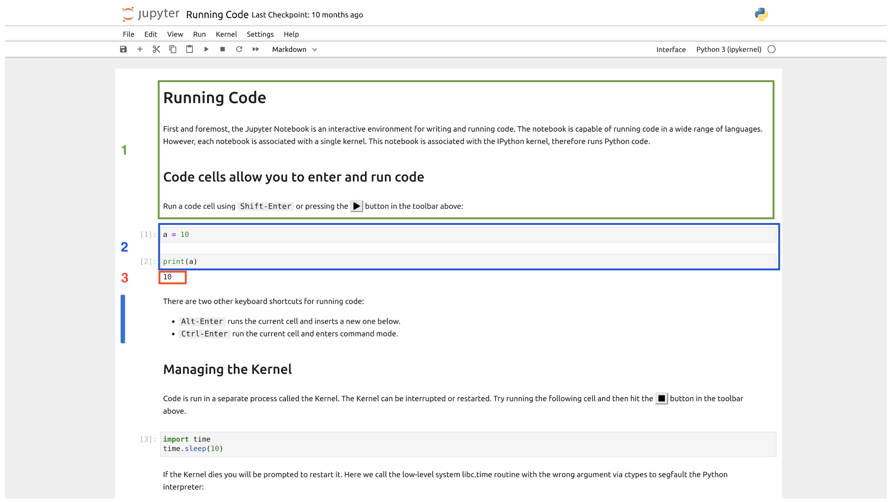

# Tutorial: Exploring coalescent variation across the genome
Mozes Blom, for questions [contact](mailto:mozes.blom@gmail.com)
___
## Requirements
* [Jupyter Lab](https://jupyterlab.readthedocs.io/en/stable/user/interface.html) or [Google Colab](https://colab.google/)
* Python 3+
    * Numpy 1.10+
    * [msprime](https://msprime.readthedocs.io/en/stable/)

___
## Introduction

The overarching aim of this practical is to visualise how genealogical history can vary across the genome and use computer simulations to explore how the rate of deep coalescence scales with past population dynamics. This tutorial can be done on its own but has been developed as a computer practical which demonstrates topics discussed in two introductory lectures: i. **Phylogenetics in the Genomic Era** and ii. **Reconciling gene tree - species tree discordance**.

For this computer practical, we will use Python modules but a minimal understanding of Python code itself will be needed as all necessary code is written out in a Jupyter Notebook. However, for those unfamiliar with Jupyter Notebooks, you can find a short introduction below to get you started.

#### Introduction to Jupyter Notebooks.
[Jupyter Notebooks](https://jupyter-notebook.readthedocs.io/en/latest/) are notebooks for computational projects, which can include snippets of code, annotation/comments and the output of code. It is an excellent way to keep track of the code that you built, the rationale behind it and is an excellent format to share code/ideas with colleagues (or your future self!).

A Jupyter notebook can contain several different sections.

