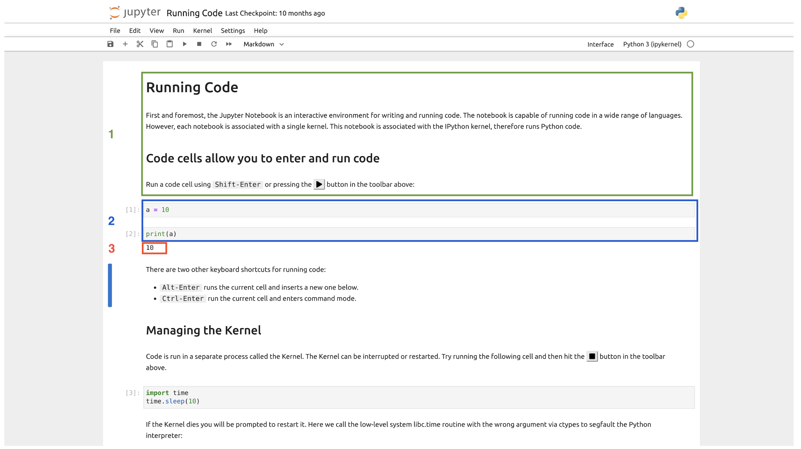
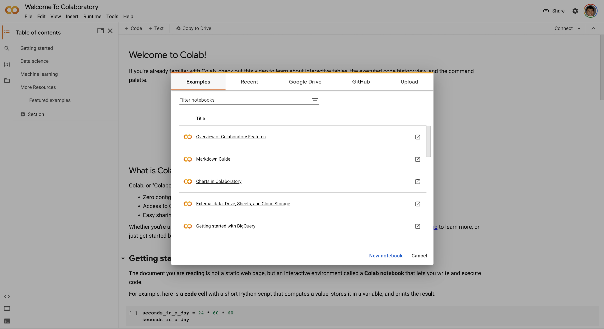
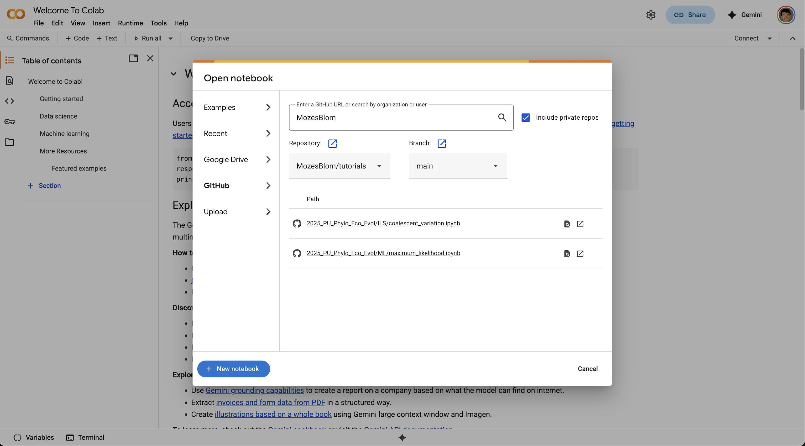

# Tutorials in evolutionary genomics

* [Computer practical Phylogenetics Course University of Potsdam 2025](https://github.com/MozesBlom/tutorials/tree/main/2025_PU_Phylo_Eco_Evol/) 
Tutorials that have been developed for the [Phylogenetics in Evolution and Ecology course](https://amniota.org/phylogenetics/) jointly taught by [Dr. Mozes Blom](https://mozesblom.com) & [Dr Faysal Bibi](https://amniota.org/) at the Museum für Naturkunde Berlin.
- [Inferring a Maximum-Likelihood phylogeny with IQtree3](https://github.com/MozesBlom/tutorials/tree/main/2025_PU_Phylo_Eco_Evol/ML)
- [Exploring coalescent variation across a genome with msprime](https://github.com/MozesBlom/tutorials/tree/main/2025_PU_Phylo_Eco_Evol/ILS)
- [Gene Tree - Species Tree inference and concordance factor annotation](https://github.com/MozesBlom/tutorials/tree/main/2025_PU_Phylo_Eco_Evol/GTST)
- [Exercise: Using Genbank to identify the phylogenetic placement of two crocodile mitogenomes](https://github.com/MozesBlom/tutorials/tree/main/2025_PU_Phylo_Eco_Evol/Crocs)

## Introduction to Jupyter Notebooks.
[Jupyter Notebooks](https://jupyter-notebook.readthedocs.io/en/latest/) are notebooks for computational projects, which can include snippets of code, annotation/comments and the output of code. It is an excellent way to keep track of the code that you built, the rationale behind it and is an excellent format to share code/ideas with colleagues (or your future self!).

A Jupyter notebook can contain several different sections.

**Section 1** is regular text in Markdown format. Markdown is a simple to use formatting language that automatically takes care of the formatting of plain text in documents. It's basically a code version of similar actions that you do in Microsoft Word using point and click. Here are a few [examples](https://www.markdownguide.org/cheat-sheet/). If you don't use any of the markdown formatting, text filled out in Jupyter notebook cells will simply appear as regular text in standard font. However, by using the markdown formatting you can create rich annotations that include links, images, etc. The present README document that you are reading is for example completely written in Markdown!

**Section 2** of the notebook are code cells. These cells/blocks generally include Python (hence the 'Py' in 'juPYter') code and can be used for computational purposes. The major benefit of Jupyter notebooks is that not only the result, but the code itself can be shared as well. In combination with the code annotation, it enables us to share our work and keep track of what/why we created a certain block of code.

**Section 3** of the notebook is the output of the code above (if output is to be expected from the code above). To make things a bit confusing: When we refer to a Jupyter notebook, we can either refer to an actual notebook created in accordance with the Jupyter notebook format (as outlined above) or the notebook application developed under the [Project Jupyter](https://jupyter-notebook.readthedocs.io/en/latest/) umbrella. By opening a notebook and going through the notebook in the editor, we can actually run the Python code in the cell blocks and evaluate the output (as done here in Section 3).

Jupyter Notebook is the lightweight application to run notebooks, but it requires a bit of background understanding to run this from commandline. Moreover it now has been generally superseded by [JupyterLab](https://jupyterlab.readthedocs.io/en/latest/) for which there is also a Desktop application: [JupyterLab Desktop](https://github.com/jupyterlab/jupyterlab-desktop)

**SUMMARY**: Computational notebooks in Jupyter format ('Jupyter notebooks') are a great way to share code and explore datasets. They are widely used in data science and are increasingly used for computational biology as well. To open and run a Jupyter notebook, we can use applications such as JupyterLab or the desktop version Jupyterlab Desktop.

## Jupyterlab vs. Google Colab

[JupyterLab](https://jupyterlab.readthedocs.io/en/latest/) or [JupyterLab Desktop](https://github.com/jupyterlab/jupyterlab-desktop) are both excellent choices to run on your own laptop. However, for the sake of tutorials, they are not optimal due to the background knowledge required to handle with dependencies. Dependencies are modules (software packages effectively) that can be required for a specific activity. For example, we may want to do an exercises that involves coalescent simulations and we therefore require a python package, [msprime](https://msprime.readthedocs.io/en/stable/), that is not standard packed with every Python installation. Handling python dependencies and modules is relatively straightforward using a package manager such as [(mini)conda](https://docs.conda.io/en/latest/miniconda.html), but it does require some command line know-how. To avoid this, all Jupyter Notebook tutorials have been designed to run in the Cloud on a [Google Colab](https://colab.google/) instance, **HOWEVER I would also strongly suggest to install [JupyterLab Desktop](https://github.com/jupyterlab/jupyterlab-desktop) on your personal machine in case you take part in an in-person computer practical!** If the internet connection is spotty OR there are not sufficient Colab instances available, we will switch to Jupyterlab Desktop during the in-person computer practicals.

**[Google Colab](https://colab.google/)**

The major benefit of Google Colab is that nothing needs to be installed on your personal machine, everything is executed on a Google computing instance. Here is a [link](https://www.youtube.com/watch?v=inN8seMm7UI) with a short introduction video and [overview](https://colab.research.google.com/?utm_source=scs-index#scrollTo=5fCEDCU_qrC0). The only thing what you need to do is to sign up for a [Google Account](https://www.google.com/account/about/) and login. Then navigate to the **[Google Colab](https://colab.google/)** webpage and click on `Open Colab`. If you are signed in with your Google Account, this should look like:

Here you can create a new notebook, continue a previous notebook which you stored locally or on Google Drive, etc. Here we benefit from the Github integration and directly point Colab to the present Github page:

Select the notebook of the tutorial that you'd like to work on and it should automatically kickstart the notebook!

